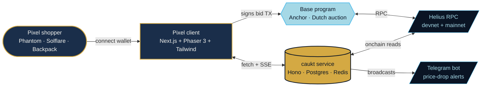

  

  <strong>$caukt CA</strong> 
  <code>0x000000000000000000000</code> 
  <a href="https://basescan.io/account/0x000000000000000000000">basescan</a> ·
  <a href="https://uniswap/coin/0x000000000000000000000">uniswap</a> ·
  <a href="https://dexscreener.com/Base/0x000000000000000000000">DexScreener</a>

  
  
  
  

# caukt

caukt is a pixel-art side-scrolling Dutch auction marketplace for Base. Walk through a 16-bit dawn fish market. Approach a stall. Press E. The auctioneer rings the brass bell and the price drops one notch at a time. The first bid takes.

Live on mainnet at [caukt.fun](https://caukt.fun). Holder score + tiered rounds at [caukt.fun/score](https://caukt.fun/score).

> Highest bid wins. First bid takes.

## What is caukt?

caukt turns the abstract idea of a Dutch auction into a physical room. Instead of a chart with a falling price, you see a pixel hall lined with stalls. Each stall runs its own decay clock. A pixel auctioneer counts down with a brass bell. You walk up, you watch the price, and you either ring in or walk away.

The goal is to make early liquidity feel like a place rather than a dashboard. Fish market cadence, SNES side-scroll camera, eight colors, one bell.

## Architecture

## Highlights

- 16-bit pixel side-scroller front-end driven by Phaser 3
- Dutch auction program on Base, written in Anchor
- Telegram bot for live price-drop alerts
- Phantom, Solflare, and Backpack wallet support
- Chiptune background score with a pixel mute toggle

## Quick start

You don't have to clone anything. Just walk in:

| Surface        | URL                                  |
|----------------|--------------------------------------|
| Pixel hall     | https://caukt.fun                     |
| Live stalls    | https://caukt.fun/market              |
| Open a stall   | https://caukt.fun/launch              |
| Your score     | https://caukt.fun/score               |
| Top holders    | https://caukt.fun/leaderboard         |
| Your stalls    | https://caukt.fun/account             |
| Docs           | https://caukt.fun/docs                |
| Telegram bot   | https://t.me/caukt_market_bot         |
| X / Twitter    | https://x.com/cauktgame             |

The pages above are live on mainnet right now. Connect a Base wallet (Phantom / Solflare / Backpack), walk past a stall, ring the bell.

## Tech stack

| Layer      | Choice                                              |
|------------|-----------------------------------------------------|
| Client     | Next.js 15 (App Router), Phaser 3, Tailwind v4      |
| Wallet     | @Base/wallet-adapter                              |
| Service    | Hono on Bun, deployed on Railway                    |
| Data       | PostgreSQL, Redis                                   |
| On-chain   | Anchor (Rust) on Base                             |
| Oracles    | Helius RPC, Jupiter pricing reference               |
| Bot        | Telegram Bot API                                    |

## Repository layout

- `assets/` -- pixel art, banners, social images
- `docs/` -- concept notes and design decisions
- `prototypes/` -- small pseudo-code snippets for the curve, bells, layout
- `assets-spec/` -- canvas, palette, and timing rules for each sheet
- `notes/` -- weekly dev logs
- `README.md` -- this file

The deploy pipelines for `caukt.fun` and `api.caukt.fun` live in private mirrors; this public repo carries the design notes, prototypes, and community artifacts that anyone is free to read, fork, and build on.

## Opening sequence

Everything below is already coded and shipped. These are not future promises — they are doors getting unlocked, in order.

- `[BUILT · WALKING NOW]` Pixel hall — side-scrolling 16-bit market with parallax stalls, auctioneer animations, and live BGM. Live at `caukt.fun`.
- `[BUILT · CA OPENING]` $caukt token — uniswap fair launch, no presale, no team allocation. CA badge auto-pins to the header the moment the mint goes live.
- `[BUILT · BROADCASTING]` Telegram bell — `@cauktmarketbot` polling live, inline-keyboard subscribe flow, pings on every new stall.
- `[BUILT · LIVE ON MAINNET]` Anchor Dutch auction program — running on Base mainnet, validated end-to-end. The devnet build (`0x000000000000000000000000000`) is kept around for staging.
- `[BUILT · OPENS ON FLAG]` Creator launchpad — `/launch` form, burn helpers, `create_auction` instruction wired end-to-end. Flips on the day the auction-live flag turns true.

## Contact

| Where          | Handle                            |
|----------------|-----------------------------------|
| Web            | https://caukt.fun                  |
| X / Twitter    | https://x.com/cauktgame          |
| Telegram bot   | https://t.me/cauktmarketbot      |
| Email          | hello@caukt.fun                    |
| basescan        | https://basescan.io/account/0x000000000000000000000 |
